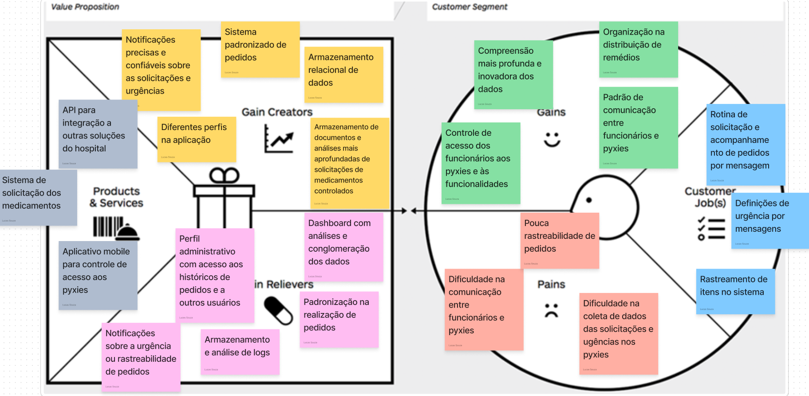

Este é o nosso canvas de proposta de valor:

## Melhorando o aplicativo móvel para controlar o acesso a pyxies

Aqui estão alguns insights sobre a proposta de valor em relação ao aplicativo PharmaControl.

### Comunicação e coleta de dados

- Há dificuldade de comunicação entre funcionários e pyxies.
- A recolha de dados para pedidos e urgências é um desafio.
- A rotina de solicitação e acompanhamento de pedidos é feita por meio de mensagens.

### Rastreamento e monitoramento

- Há falta de rastreabilidade dos pedidos.
- É necessária a rastreabilidade dos itens no sistema.
- São necessárias notificações precisas e confiáveis sobre solicitações e urgências.

### Controle de acesso e permissões

- É necessário um melhor controle do acesso dos funcionários aos pyxies e funcionalidades.
- São desejados diferentes perfis de usuário no aplicativo.
- É necessária uma API para integração com outras soluções do hospital.

### Análise e relatórios

- Existe um desejo de uma compreensão mais profunda e inovadora dos dados.
- O armazenamento e a análise de registros são importantes.
- É desejado um painel com análise e agregação de dados.

### Padronização e organização

- É necessária padronização no processo de pedido.
- É desejada organização na distribuição de medicamentos.
- É desejável o armazenamento de documentos e a análise aprofundada das solicitações de medicamentos controlados.
