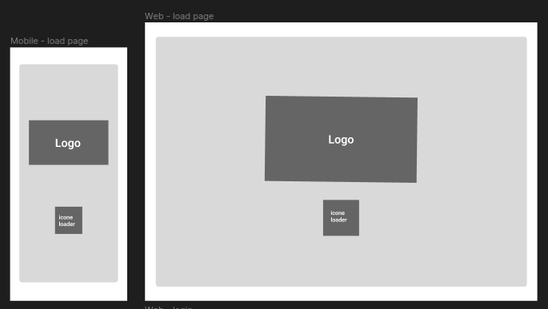
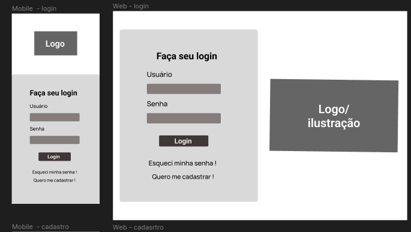
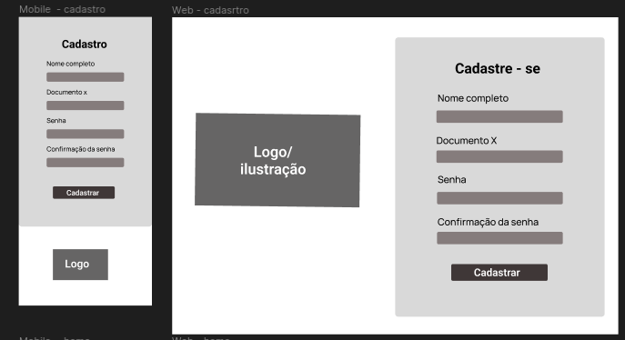
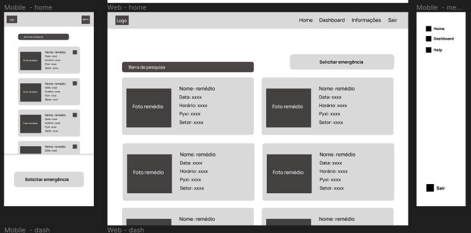
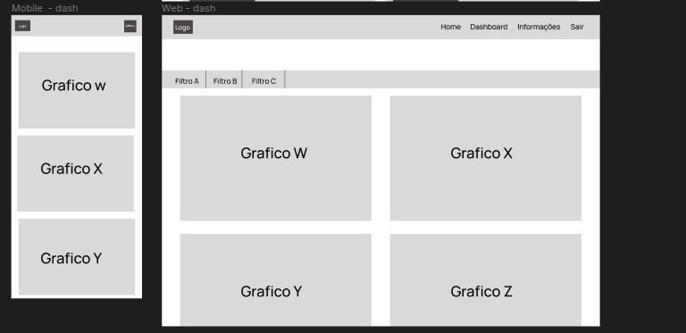

# Wireframe

## Página de load 

- Para a página de carregamento foi pensado em um design simples apenas para servir como “capa” da aplicação contendo a logo e um icone de carregamento para sinalizar que a aplicação está iniciando.

## Página de login
- Para a página de login, é utilizado a logo novamente para utilizar da heurista de consistência para estar conectado com a página anterior. Os elementos principais são o formulário para realizar o login e o botão de logar além da possibilidade de se cadastrar ou recuperar senha abaixo.

## Página de cadastro
- Para a página de login, é utilizado novamente os mesmos elementos da tela de login, contudo é feita uma inversão de eixo dos compontentes, possibilitando assim um ganho de dinamicidade para a aplicação caso o usuário esteja entrando pela primeira vez e precise realizar o cadastro. 

## Página de home
- Para a página de home terá uma barra de pesquisa para pesquisar as emergências, outros elementos importantes são o menu tipo burger que terá uma animação de side bar da direta para a esquerda. Além disso outro ponto crucial é o botão de solicitar emergência que permite a criação de uma nova emergência e a identificação nos cards sobre o nivel de cuidado com o remédio caso seja um tarja vermelha ou preta. Outra modificação notável é o uso da navbar para a navegação da visualização web além da ampliação da visualização devido ao espaçõ maior de tela. 

## Página de dashboards 
- Para a página de dash a visualização dos graficos sera na vertical para que cada gráfico ocupe toda a área visivel na sua altura de tela, possibilitando assim a melhor visualização das informações do gráfico. Já para a visualização web foi pensado em 2 graficos na mesma linha para complementrar a visualização além da possibilidade de aplicação de filtros, que pode ser implementada na visualização PharmaControl, contudo  seguindo o padrão de aplicações web é mais comum visualizações com filtros em sites do que apps. 

