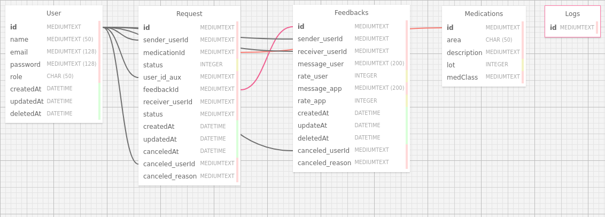

## Introdução

O Sistema de Requisição de Medicamentos - Pyxis é uma aplicação desenvolvida para o Hospital Sírio Libanês com o objetivo de facilitar o processo de solicitação de medicamentos em falta. Através dessa aplicação, os profissionais de saúde podem requisitar medicamentos que estão em falta no estoque do hospital, garantindo assim um fluxo contínuo e eficiente de abastecimento.

### Estrutura do Banco de Dados

O banco de dados da aplicação é composto por diversas tabelas que armazenam informações cruciais para o funcionamento do sistema. As principais tabelas incluem:

**1. Tabela `User`**

Esta tabela armazena informações sobre os usuários do sistema, incluindo profissionais de saúde e administradores.

|Coluna        | Tipo       | Descrição                               |
|--------------|------------|-----------------------------------------|
|id            | String (uuid)     | Chave primária do usuário               |
|name          | String     | Nome do usuário                         |
|email         | String     | E-mail do usuário                       |
|password      | String     | Senha do usuário                        |
|role          | String     | Função do usuário (não obrigatório)     |
|createdAt     | DateTime   | Data de criação do usuário              |
|updatedAt     | DateTime   | Data da última atualização do usuário   |
|deletedAt     | DateTime   | Data de exclusão do usuário (opcional)  |

**2. Tabela `Feedback`**

Esta tabela armazena feedbacks dos usuários sobre o sistema.

|Coluna           | Tipo       | Descrição                                       |
|-----------------|------------|-------------------------------------------------|
|id               | String (uuid)      | Chave primária do feedback                      |
|message_user     | String     | Mensagem do usuário                             |
|message_app      | String     | Mensagem do sistema                             |
|rate_user        | Int        | Avaliação do usuário sobre o sistema            |
|rate_app         | Int        | Avaliação do sistema sobre o usuário (opcional) |
|createdAt        | DateTime   | Data de criação do feedback                     |
|updatedAt        | DateTime   | Data da última atualização do feedback          |
|deletedAt        | DateTime   | Data de exclusão do feedback (opcional)         |
|sender_userId    | String     | ID do usuário remetente do feedback             |
|receiver_userId  | String     | ID do usuário destinatário do feedback           |

**3. Tabela `Request`**

Esta tabela armazena as solicitações de medicamentos feitas pelos usuários.

|Coluna           | Tipo       | Descrição                                       |
|-----------------|------------|-------------------------------------------------|
|id               | String (uuid)      | Chave primária da solicitação                   |
|medicationId     | Int        | ID do medicamento solicitado                    |
|status           | String     | Estado da solicitação (pendente, aceita, etc.)  |
|sender_userId    | String     | ID do usuário que fez a solicitação             |
|receiver_userId  | String     | ID do usuário que recebeu a solicitação         |
|feedbackId       | String        | ID do feedback relacionado à solicitação        |
|createdAt        | DateTime   | Data de criação da solicitação                  |
|updatedAt        | DateTime   | Data da última atualização da solicitação       |
|canceledAt       | DateTime   | Data de cancelamento da solicitação (opcional)  |
|canceled_userId  | String     | ID do usuário que cancelou a solicitação        |
|canceled_reason  | String     | Motivo do cancelamento da solicitação (opcional)|

**4. Tabela `Medications`**

Esta tabela armazena informações sobre os medicamentos disponíveis no sistema.

|Coluna      | Tipo       | Descrição                               |
|------------|------------|-----------------------------------------|
|id          | String (uuid)     | Chave primária do medicamento           |
|area        | String     | Área do hospital onde o medicamento está disponível |
|description | String     | Descrição do medicamento                |
|lot         | Int        | Lote do medicamento                     |
|medClass    | String     | Classe do medicamento                   |

**5. Tabela `Logs`**

Esta tabela armazena registros de atividades, erros e outras mensagens de registro para fins de monitoramento e auditoria.

|Coluna | Tipo | Descrição                              |
|-------|------|----------------------------------------|
|id     | String (uuid)| Chave primária do registro de log      |

### Modelo Conceitual do Banco

O modelo conceitual do banco de dados do Sistema de Requisição de Medicamentos - Pyxis reflete a estrutura e as relações entre os principais elementos do sistema, fornecendo uma visão abstrata e organizada das entidades e de como elas se relacionam entre si.

### Funcionamento

1. **Registro de Usuários:** A aplicação permite o registro de profissionais de saúde e administradores para utilização do sistema.

2. **Solicitação de Medicamentos:** Os profissionais de saúde podem solicitar medicamentos que estão em falta no estoque do hospital através da aplicação.

3. **Feedback do Usuário:** Os usuários podem fornecer feedback sobre a aplicação, tanto sobre a experiência de uso quanto sobre a disponibilidade e qualidade dos medicamentos.

4. **Histórico de Solicitações:** O sistema registra o histórico de todas as solicitações de medicamentos, incluindo seu status atual e eventuais feedbacks relacionados.

5. **Monitoramento e Auditoria:** Registros de atividades, erros e outras mensagens de registro são armazenados para fins de monitoramento, depuração e auditoria.

## Conclusão

O Sistema de Requisição de Medicamentos - Pyxis é uma ferramenta essencial para garantir um fluxo contínuo de abastecimento de medicamentos no Hospital Sírio Libanês. Com uma estrutura de banco de dados bem definida e funcionalidades adaptadas às necessidades dos profissionais de saúde, a aplicação oferece uma solução eficaz para gerenciamento de medicamentos em falta.
