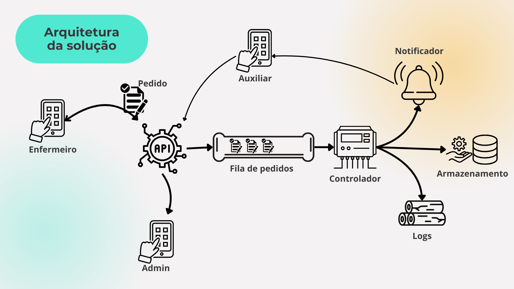

## Enfermeiro

- O enfermeiro utiliza o aplicativo móvel para verificar o estoque de materiais, identificando alguma falta de suprimentos necessários para os procedimentos.

## API

- Recebe a solicitação de reposição de materiais do enfermeiro.

### Fluxo

1. **Enfermeiro verifica o aplicativo "Pyxi" e identifica falta de material.
2. **Enfermeiro utiliza o aplicativo para realizar um pedido de reposição.

### Caminhos da API

- **Caminho 1 (Superior - Notificação ao Auxiliar de Enfermagem):**
  - A solicitação é encaminhada para o auxiliar de enfermagem.
  - O auxiliar de enfermagem recebe uma notificação em seu dispositivo móvel informando sobre o pedido de reposição.

- **Caminho 2 (Fila de Pedidos - Processamento pelo Controlador):**
  - A solicitação é enfileirada para processamento.
  - Um controlador de pedidos é acionado para processar a solicitação.
  - O controlador executa três tarefas:
     1. Notificação: Informa os responsáveis pela reposição sobre o pedido.
     2. Armazenamento: Registra os detalhes do pedido no banco de dados para controle e rastreamento.
     3. Sistema de Logs: Registra informações sobre o processamento do pedido para fins de auditoria e monitoramento.

- **Caminho 3 (Direcionamento para o Admin):**
  - A solicitação é encaminhada para o administrador responsável pela gestão de suprimentos.

## Fluxo da Solução

1. **Enfermeiro Verifica o Estoque:**
   - O enfermeiro acessa o aplicativo móvel "Pyxi" para verificar o estoque de materiais necessários para os procedimentos.

2. **Identificação de Falta de Material:**
   - O enfermeiro identifica a falta de algum material essencial para a realização dos procedimentos.

3. **Solicitação de Reposição:**
   - O enfermeiro utiliza o aplicativo para solicitar a reposição dos materiais em falta.

4. **Roteamento da Solicitação na API:**
   - A solicitação é enviada para a API, que a roteia para os diferentes caminhos de processamento, conforme descrito na arquitetura da solução.

5. **Notificação ao Auxiliar de Enfermagem:**
   - No caminho superior da API, a solicitação é encaminhada ao auxiliar de enfermagem, que recebe uma notificação sobre o pedido.

6. **Processamento da Solicitação pelo Controlador:**
   - No caminho da fila de pedidos, a solicitação é processada pelo controlador, que executa as tarefas de notificação, armazenamento e registro de logs.

7. **Direcionamento ao Administrador:**
   - A solicitação também é direcionada ao administrador responsável pela gestão de suprimentos para avaliação e ação adequada.

