# Mockup

- Para a criação do mockup, foi pensada a prototipação de três fluxos principais para o projeto. O primeiro deles, mais simples, é o fluxo do administrador, que seria a pessoa responsável por visualizar os dados produzidos e coletados pela aplicação a fim de resolver possíveis gargalos no fluxo de operação e identificar problemas em alguma etapa. O segundo fluxo é o fluxo do auxiliar de enfermagem, sendo este um pouco mais complexo do que o do administrador, contudo, este fluxo ainda se mantém um pouco mais simples do que o terceiro fluxo. O fluxo do enfermeiro é o que possui o maior nível de complexidade, tendo em vista a quantidade de ações e user stories destinadas a ele, visando ser o usuário principal do aplicativo..

## Página de carregamento e página de login

- Essas duas páginas são comuns para todos os fluxos, pensando na utilização do próprio registro interno para efetuar o login e criar a diferenciação de cada fluxo para cada usuário.

### Página de carregamento

- A página de carregamento é apenas um método de espera para o aplicativo inicializar, sendo bem simples com conteúdos estáticos e sem interações.

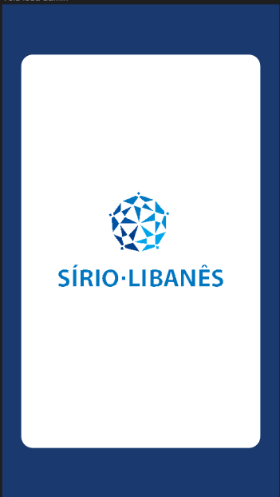

### Página de login

- Para a página de login, foi pensado apenas dois campos, como usuário e senha, e um botão para efetuar o login que, após a validação do usuário, iria direcioná-lo para o seu respectivo fluxo, além de um hyperlink para caso o usuário tenha esquecido a sua senha, que irá redirecioná-lo para o sistema interno da empresa.

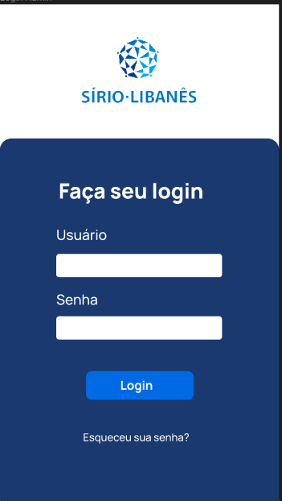

## Fluxo do administrador

- Após ter passado pelas telas de carregamento e login nesse primeiro fluxo, ele será direcionado para a home, que contém os dados principais de todos os pedidos, sendo possível pesquisar um atendimento específico.

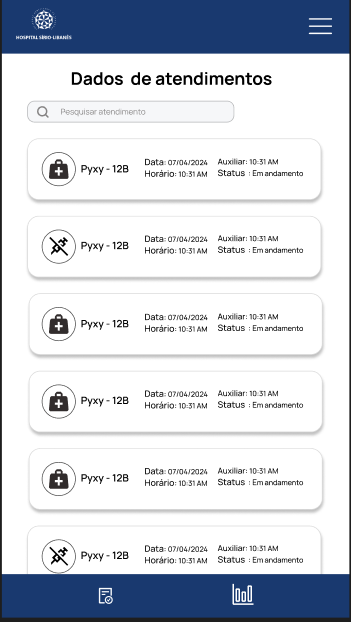

- Nessa página é possível acessar a sidebar para navegar para a próxima página. Dentro dessa sidebar, é possível ver 3 ícones e um botão de voltar. Os ícones referem-se à home, à página de dashboard e a uma futura página de ajuda.

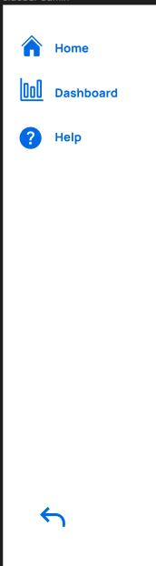

- Por fim, a última página deste fluxo é a página de dashboards. Ela ainda não está bem definida, pois os verdadeiros gráficos serão utilizados com outra interface, sendo o metabase para trazer o dashboard. Portanto, essa página serve apenas para simular a visualização no ambiente PharmaControl.

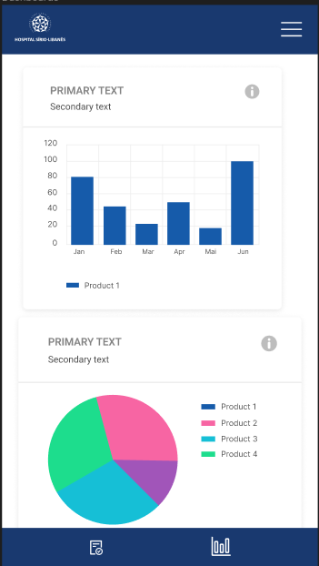

## Fluxo do auxiliar

- Para o fluxo do auxiliar, após a tela de login, ele será redirecionado para a home apresentando o status de indisponível. Nela, é possível acessar uma sidebar semelhante à do administrador, contudo com páginas diferentes, sendo estas apenas a home e a página de ajuda. Outra interação possível é a navegação pelo footer da página, que pode direcionar o usuário para a tela de perfil ou para a tela de histórico de pedidos e, por fim, para estar apto para receber pedidos, o usuário precisa habilitar através do botão principal no canto inferior direito da tela.

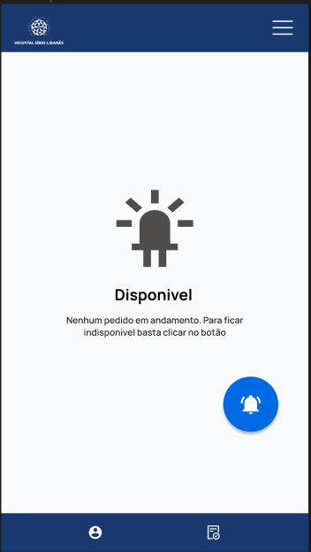

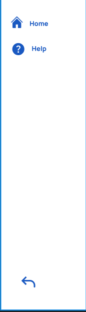

- Assim, após se tornar disponível, o auxiliar irá visualizar a home de maneira diferente com um botão para voltar ao estado de indisponível, além de estar apto a receber um pedido a qualquer momento.

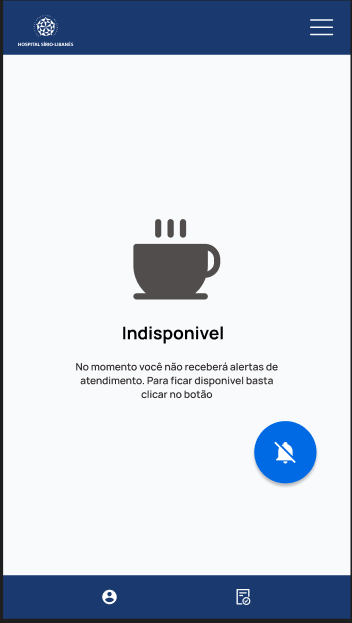

- Após ele receber uma notificação, ele terá a opção de aceitar ou negar a solicitação. Caso ele negue a solicitação, ele será redirecionado para a home e aguardará uma nova solicitação ou desativar o modo disponível. Caso ele aceite a solicitação, ele será redirecionado para a página correspondente daquela solicitação com as informações e instruções para a realização do pedido.

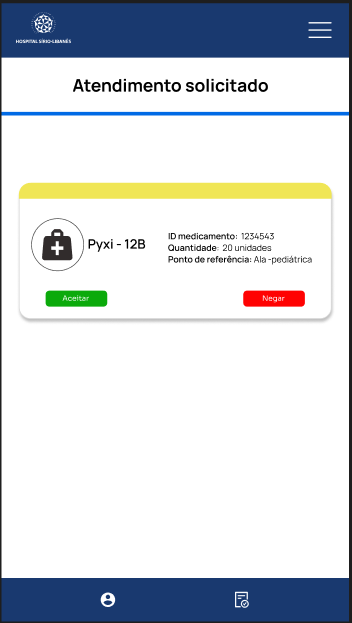

- Na página de solicitação recebida, é possível ver dados sobre os pontos em que o auxiliar deve ir e as informações da entrega, como qual pixy deve ser reabastecido, com qual medicamento e com quantas unidades, além de outras informações complementares para facilitar a entrega.

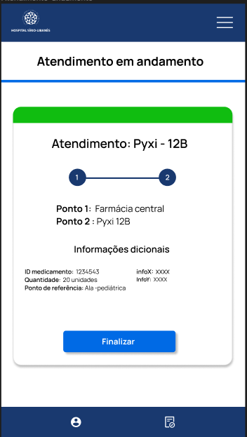

- Por fim, após finalizar um pedido, é mostrado um modal que confirma a finalização daquela solicitação e o usuário é redirecionado para a página de home.

- A última tela do fluxo corresponde à de histórico de pedidos finalizados, que pode ser acessado através da navegação pela barra de footer de qualquer tela.

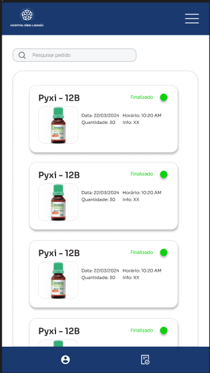

## Fluxo do Enfermeiro

- Após a finalização do login, ele será direcionado para a home, que possui diversas interações. A primeira, mais notável, é a visualização dos principais remédios solicitados por ele, sendo possível visualizá-los como cards em um carrossel. Outra interação é a solicitação de um remédio, sendo possível visualizar e clicar no botão para solicitar um medicamento. Esta página possui a navegação pelo footer com cada ícone referente a uma página. O primeiro ícone de lupa é responsável por levar à página de solicitações, podendo visualizar as solicitações em andamento, canceladas e enviadas. Já o outro ícone é responsável por levar à página de pedidos finalizados.

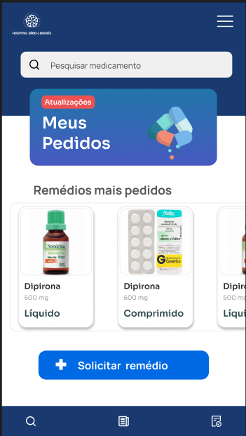

- Ao clicar no botão de solicitar o remédio, o usuário será direcionado para o formulário de requisição de pedido com algumas informações importantes para a solicitação.

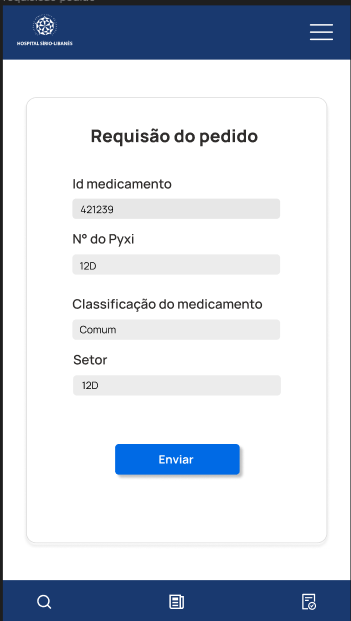

- Após o envio do formulário, será apresentado um modal de confirmação para o usuário, que será redirecionado para a home.

- Assim, ao clicar em alguns dos remédios do carrossel, é possível visualizar algumas informações sobre ele e efetuar a sua solicitação. Após finalizada, será exibido o mesmo modal acima e o usuário será redirecionado para a home.

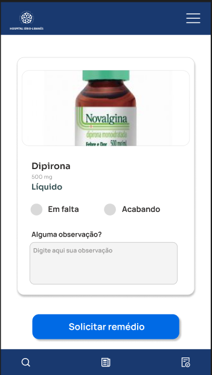

- Utilizando a navegação do footer, é possível acessar a página de pedidos em andamento, cancelados ou apenas enviados através do ícone da lupa. Nessa página, é possível ver todos os pedidos com um carrossel vertical de cards, onde cada card apresenta as informações principais do pedido e o seu status, sendo possível pesquisar o pedido.

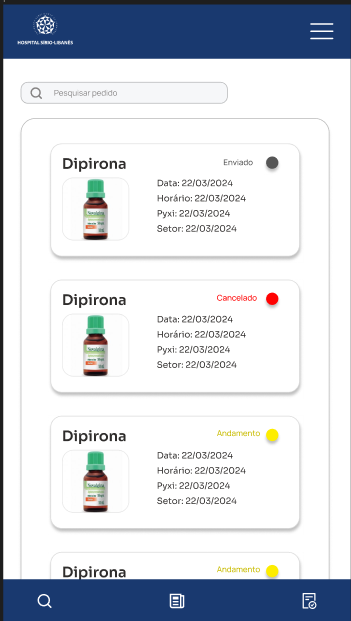

- A outra página acessível através da navegação via footer é a de pedidos finalizados, que mostra todos os pedidos finalizados, algumas informações sobre eles e um botão de avaliar, caso o pedido precise ser avaliado, ou apenas o botão verde não clicado, confirmando que aquele pedido foi avaliado.

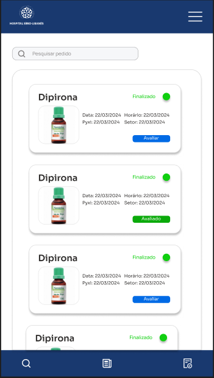

- Por fim, caso o pedido não tenha sido avaliado e o usuário clique no botão de avaliar, será direcionado para a tela de avaliação, composta por dois campos para avaliar de 1 a 5, um campo para deixar um comentário e o botão de enviar, que após clicado mostrará um modal de confirmação de que a avaliação foi enviada.

 

## Visualização web

- Para a visualização do fluxo do administradors em tamanho web basta acessar este figma [aqui](https://www.figma.com/design/E0qTu6YfgTYHE7ysGgXbAU/wireframe-project?node-id=0%3A1&t=y8bNy6hi15HWBR5A-1). Já para a visualização dos fluxos com interações baste clicar em [Admin](https://www.figma.com/proto/E0qTu6YfgTYHE7ysGgXbAU/wireframe-project?node-id=232-91&t=BknFjIeldTAao4o5-1&scaling=min-zoom&page-id=0%3A1&starting-point-node-id=1%3A2&show-proto-sidebar=1), [Enfermeiro](https://www.figma.com/proto/E0qTu6YfgTYHE7ysGgXbAU/wireframe-project?node-id=113-157&t=t98tqCxcrcIbBTgv-1&scaling=min-zoom&page-id=0%3A1&starting-point-node-id=113%3A150&show-proto-sidebar=1) ou [Auxiliar](https://www.figma.com/proto/E0qTu6YfgTYHE7ysGgXbAU/wireframe-project?node-id=232-78&t=KY2eJsuQq65ZhW7P-1&scaling=min-zoom&page-id=0%3A1&starting-point-node-id=182%3A147&show-proto-sidebar=1).