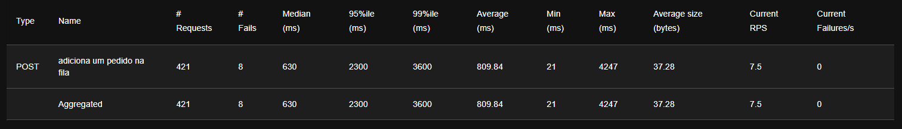
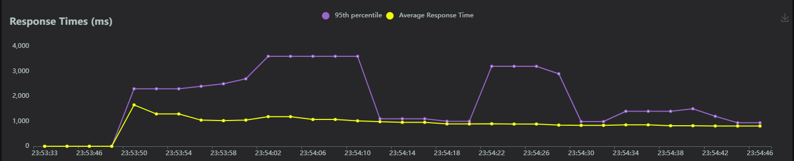
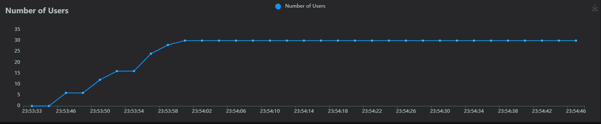
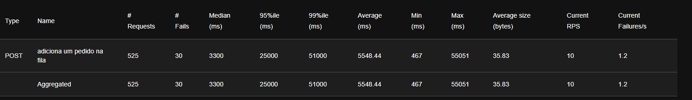
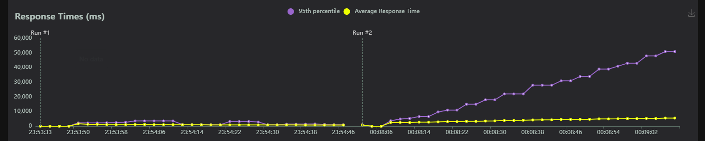
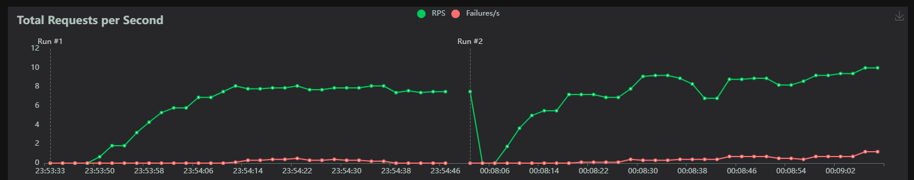
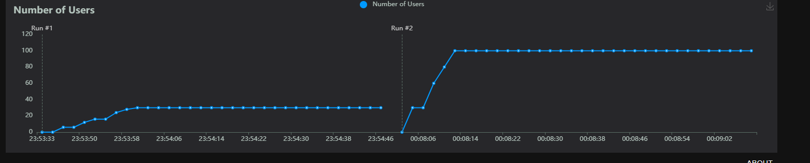

# Teste de Carga

- Para o teste de carga, foi analisada a rota principal que publica um pedido na fila. O objetivo foi testar quantos usuários poderiam utilizar essa rota simultaneamente e qual seria o comportamento da nossa aplicação. O teste apresenta algumas métricas importantes, sendo elas:
  - Minimum (Min): O menor tempo de resposta registrado.
  - Maximum (Max): O maior tempo de resposta registrado.
  - Average (Avg): A média dos tempos de resposta.
  - Median (Median): O tempo de resposta no percentil 50.
  - Percentis (95%, 99%): Indicam o tempo de resposta que 95% ou 99% das requisições não excederam.
  - Taxa de Falha: Quantas requisições falharam.
  - Taxa de Sucesso: Quantas requisições foram bem-sucedidas.

## Cenários de Teste
- Para os cenários de teste, foi pensado em um cenário mais brando com 30 usuários e um cenário um pouco mais exaustivo com 100 usuários simultâneos. A intenção de utilizar mais de um cenário é comparar como a aplicação se comporta em diferentes níveis de uso.

### Primeiro Cenário
- Durante o primeiro cenário, obtivemos as seguintes métricas:
  
  

Apesar do baixo índice de erros, considerando 8 requests que falharam em relação às 421 efetuadas, implicando em uma taxa de erro de aproximadamente **2%**, para um teste em um cenário brando essa métrica não é ideal, tendo em vista que era esperado 0 falhas. Analisando a média do tempo de requisição em **810** milissegundos, e os tempos máximos e mínimos de requisição, é notável a disparidade dos valores, o que pode ter influenciado no aumento da média devido à sensibilidade desta métrica a valores extremos. Outra métrica relevante é o percentil de 95%, que indica que o tempo máximo de 95% das requisições está abaixo de **2300** milissegundos, o que não é um valor ideal para a magnitude do teste.

#### Gráficos
- Através da interface do Locust, é possível visualizar 3 gráficos principais sobre as requisições feitas: um gráfico de tempos de resposta por requisição, um gráfico sobre o número de usuários e um gráfico sobre o total de requisições por segundo.

#### Tempo de Resposta

  

#### Total de Requisições por Segundo

  

#### Número de Usuários

  

Apesar da visualização não ser tão clara devido ao tamanho e à demarcação dos eixos, os três gráficos estão alinhados à mesma série temporal relacionada ao eixo X, sendo possível comparar as três métricas apresentadas e sua variação no tempo. Uma informação importante a se observar é o aumento no percentil de **95%** das requisições no mesmo espaço de tempo do pico de usuários e aumento de requisições por segundo, indicando um momento de pico da aplicação. Outra informação relevante é a observação da presença de falhas nos pontos do minuto **23:54:10**, localizado no gráfico em um momento de queda brusca no tempo de resposta, possibilitando a inferência de que a causa da falha foi o volume de requisições e a recomposição da aplicação após a falha.

### Segundo Cenário

- Durante o segundo cenário, obtivemos as seguintes métricas:

  

É notável a diferença de performance entre os dois testes, não só pela taxa de erro de aproximadamente **6%**, mas também pelo tempo médio entre as requisições. O tempo máximo e mínimo tiveram um aumento acima do esperado, com um tempo máximo de 55051 milissegundos.

#### Comparativo
- Os gráficos abaixo são referentes às mesmas métricas apresentadas nos gráficos acima, mas agora possuindo dados do primeiro e do segundo cenário.

#### Tempo de Resposta

  

#### Total de Requisições por Segundo

  

#### Número de Usuários

  

## Conclusão do Teste
Após a análise comparativa dos dois cenários de teste e avaliação da complexidade da rota testada, fica claro a necessidade de evolução da arquitetura do backend a fim de torná-la mais performática e condizente com as expectativas de uma aplicação escalável. Sendo assim, um dos principais pontos a serem evoluídos é a utilização de microserviços e um orquestrador para garantir que a aplicação não sofra tanto com um volume "alto" de requisições.
