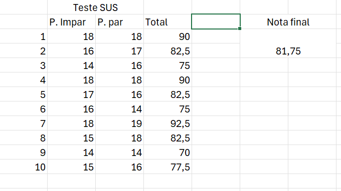
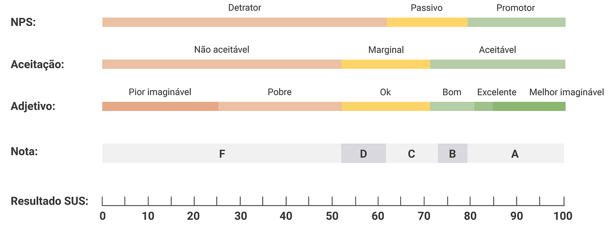

## O que é o teste SUS

- O Sistema de Escala de Usabilidade (SUS) é um método de avaliação rápida de usabilidade. Consiste em um questionário com 10 perguntas que os usuários respondem usando uma escala de 1 a 5. As respostas são convertidas em uma pontuação de 0 a 100, ajudando a medir a facilidade de uso e a satisfação do usuário com o sistema.

## Fluxos testados

- Para o teste de usabilidade foi testado o fluxo do enfermeiro apresentado na documentação do wirefram e do frontend. Entretanto os outros fluxos também foram citados, mas não foram considerados para a avaliação visando ter dados e feedbacks apenas de um fluxo de uso.

## Execução dos testes

- Os tetes foram executados em sala de aula utilizando outros colegas de classe que utilizaram o fluxo no forntend estático mas com as funcionalidade de navegação e exibição de elementos na tela mobila ja implementadas, e avaliaram o fluxo utilizando as perguntas e critério do método SUS.

## Resultado dos testes

- Após a aplicação todas as fixas foram tabuladas para o calculo da pontuação final de cada teste, finalizando um total de 10 testes que contribuiram para média final de 81.75.

## Conclusão

- É notável que a nossa interface está com design intuitivo e visualmente agradável, mas ainda precisamos melhorar algumas funcionalidades para torná-las mais fluidas e contribuir para a experiência do usuário.
